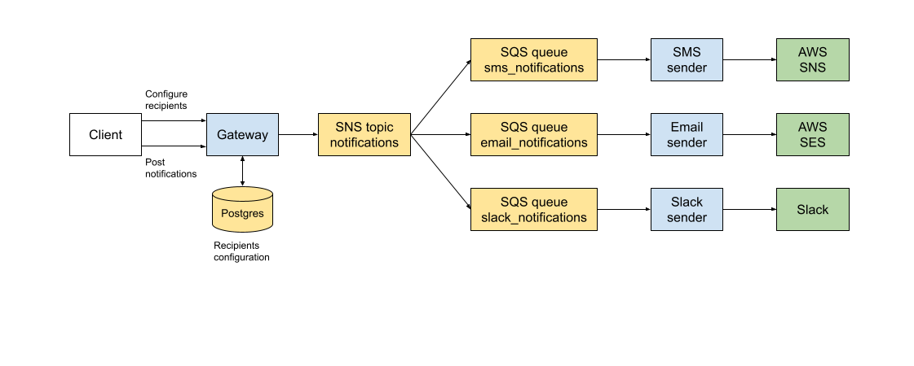

# Notifications System

## Overview

This project implements a notification-sending system.
Currently it supports SMS, email and Slack as notification channels.

It consists of several components



The *Gateway* microservice is the entry point to the system. It exposes 2 REST APIs:
- `/recipients` - manage recipients configuration. Each recipient is identified by his name.
Also each recipient may have a phone number, an email address or a Slack ID. At leas one of these is required.
- `/notifications` - post notifications. Each notification consists of a recipient name and a message. The recipient should match one of the recipients configured above.

This way the system separates the notifications from the actual destination where they are delivered.
So, the client is not concerned about the details of the notification delivery.

Gateway APIs are protected via mTLS. So the client has to obtain a client certificate signed by the trusted CA.

Upon receiving a new notification the Gateway loads the corresponding recipient configuration and posts all the data to SNS topic `notifications`.

3 SQS queues are subscribed to this topic - one for each delivery channel.
Each queue is processed by a separate microservice. This way we isolate the different delivery channels. We can develop maintain and scale each of these independently according to requirements.

Currently the system uses some AWS services. These could be replaced with alternative solutions from other vendors. The same is true also for the database, which is currently implemented via Postgres.

### Resilience

If the Gateway fails to process some API request, it will return the corresponding status. Then the client can retry the request.

If some of the sender services fail, SQS will resend the message and the operation will be retried.
Currently SQS queues are configures with 5 attempts. If the error persists, the message will go the respective DLQ. Then the issue should be investigated. After fixing it, the message can be replayed or deleted.

## Tests

Currently this project has only integration tests that run locally.
We use [LocalStack](https://www.localstack.cloud/) to run necessary AWS services locally.

AWS resources are provisioned via Terraform, see [terraform/resources.tf](terraform/resources.tf).

We use [WireMock](https://wiremock.org/) to mock the Slack API.

Before running the tests we need to generate the keys and certificates required for mTLS.
To do that run
```sh
mtls/generate.sh 
```
The resulting .pem files will appear in `mtls` directory.

Next, start all the services
```sh
docker compose up --build -d --wait
```

Now, you are ready to run the tests
```sh
go test -v -count=1 ./...
```

## Pending

There are many things missing for this project to be production-ready.

### Deployment

There are different approaches possible here.

One is to extend the Terraform configuration and deploy all the components on AWS. The Go microservices could run on ECS. The docker containers are already built. AWS RDS could be used as a managed Postgres service.

Of course the Go services can be deployed also on Kubernetes (EKS).

Deploying on a different cloud provider (e.g. GCP or Azure) would probably require updating the Go code to use the respective messaging services.

### What else
- CI/CD (e.g. via GitHub Actions)
  - Static checks, e.g. linter
  - Tests
  - Performance tests
  - Security checks, e.g. Snyk
- Authentication - could be changed to something else like OAuth if necessary
- Authorization - probably different clients will manage recipients and post notifications, so it makes sense to separate those permissions
- Put credentials in a secure store, e.g. Vault
- Improve logging, e.g. use [slog](https://pkg.go.dev/golang.org/x/exp/slog) to emt structured logs that are easier to analyze (for example with ELK)
- Improve input validation
- ...